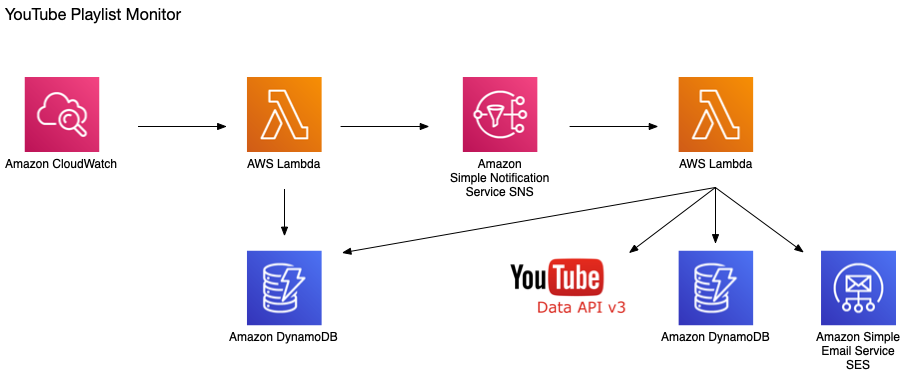

# YouTube Playlist Monitor

When a video in a YouTube playlist is deleted or set to private, it shows as such leaving you to wonder what that video was.
YouTube Playlist Monitor will monitor changes in your playlist and sends an email about deleted playlist items.




## Setup

- Install dotnet  
- Install LambdaSharp
    ```bash
    dotnet install -g LambdaSharp.Tools
    lash init --tier tiername --quick-start
    ```
- AWS SES Domain or Email Verified

## Deploy

```bash
lash deploy --tier tiername --profile profilename
```

> When prompted for the `FromEmail`, use the email provided in 'AWS SES Domain or Email Verified' in the setup

## TODO
- update tests/write more
- better formatting of email
- front end subscription management screen
- turn updaing database into batch write requests
- exponental backoff of youtube api request -- check for error code
- step functions for long running playlists?
- with caching, maybe do a fanout?